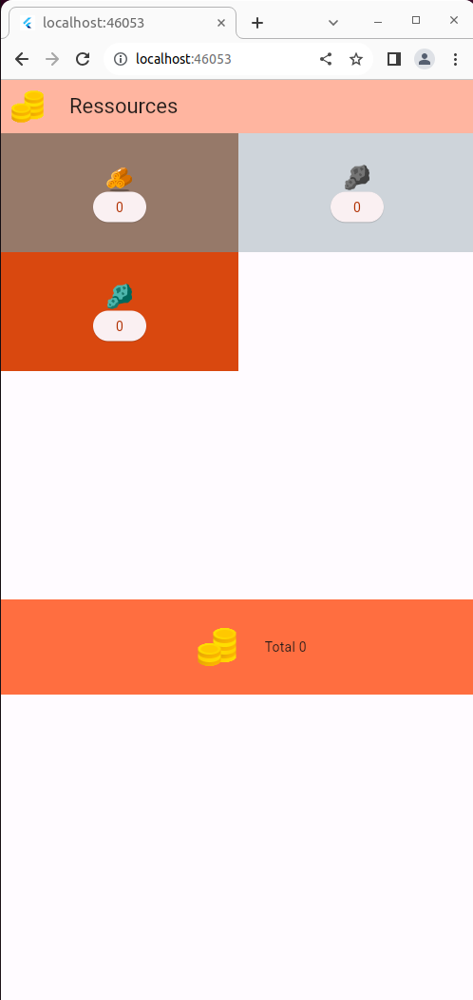
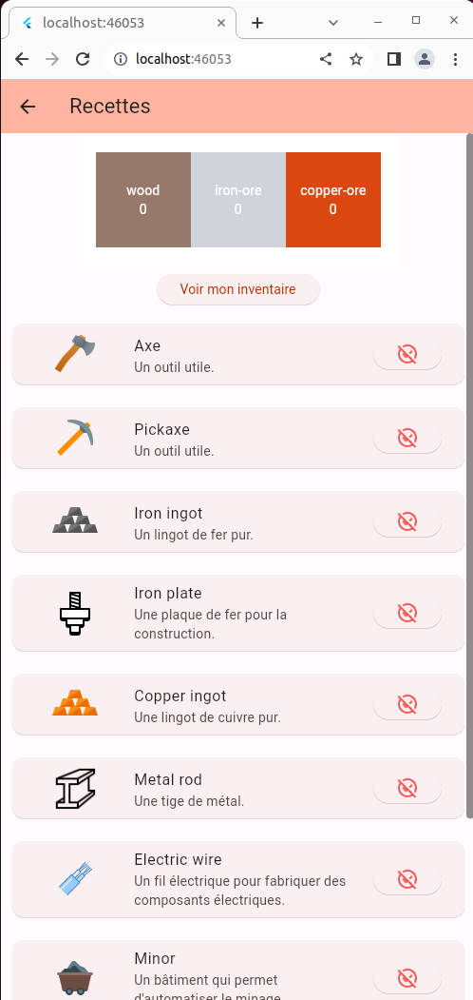
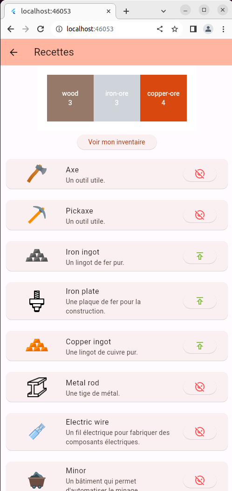
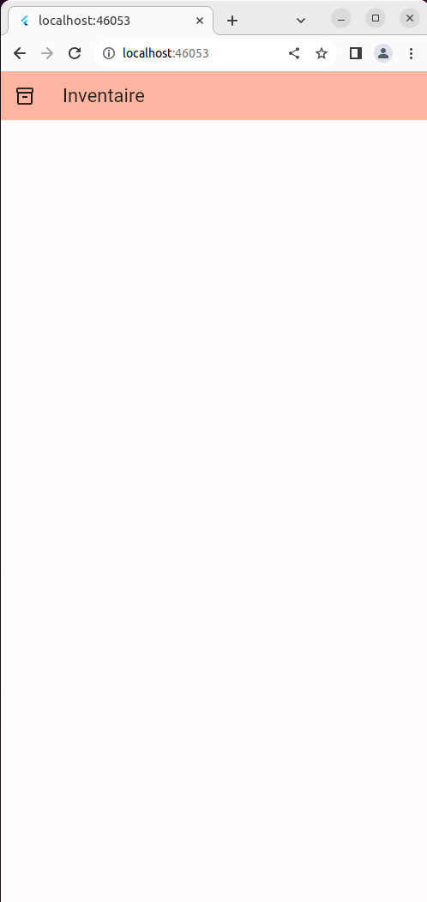
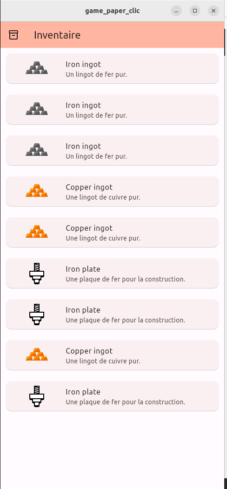

# game_paper_clic
	
## SSH project Clone 
``` 
git clone git@github.com:davg80/game_paper_clic.git
```
## https project Clone 
``` 
git clone https://github.com/davg80/game_paper_clic.git
```

## _Objectifs du projet_:
1- Clique sur chaque ressource pour récolter une unité

2- Débloque des recettes et de nouveaux éléments de gameplay pour progresser dans le jeu

Découpage de l'application

1- Page d'accueil dont le titre est ressources
	- Démarre le jeu direct
	- Widget GridView pour présenter les ressources disponibles
	- Widget Ressource
		- rectangle de couleur sur la gridView
		- label Miner
	- le bouton est cliqué, 1 unité est récoltée
	- Total de ressources récoltées

2- Ajouter un bouton dans l'AppBar de la route Ressources pour naviguer vers une nouvelle Route Recettes
	- Utilisation d'une méthode de navigation
	- https://fonts.google.com/icons pour les icones
	- Cette route doit afficher toutes les recettes du jeu dans une ListView
	
3- Chaque Recette : Nom, sa description, son coût en ressources
	- Ajouter le bouton Produire pour produire l'objet
	- Un objet produit est ajouté à l'inventaire
	
4- Bouton Produire : 
	- Si ressources pas suffisantes, on ne peut pas produire l'objet
	- Donné un look disabled si la recette n'est pas disponible
	
5- Ajouter un bouton dans l'AppBar de la route Ressources pour naviguer vers une nouvelle Route Inventaire
	- cette route doit afficher tous les items produits sur la route Recettes dans une ListView

6- joueur a fabriqué 1000 lingots de fer et 1000 lingots de cuivre, la nouvelle ressource à récolter Charbon est affiché et disponible dans la route Ressources

7- Ajouter un bouton dans l'AppBar de la route Inventaire pour permettre de trier l'inventaire par nom
 - Ajouter un bouton dans l'AppBar de la route Inventaire pour permettre de trier l'inventaire par quantité
 
 8- Ajouter un nouvel élément de gameplay : 
  - une nouvelle page
  - une nouvelle action
  - une nouvelle interaction
  - une nouvelle recette
  
 9 - Pensez à l'automatisation de l'application
 	- un Mineur extrait 3 items/seconde 
 	- une fonderie transforme 1 minerai brut/seconde
 !!!!! Attention : On ne peut pas construire plus de mineurs qu'il y a de type de ressources.
 
 Implémenter les recettes Mineur et Fonderie dans le jeu
 
##  Références/Ressources
- Liste des ressources qui ont servies
J'ai beaucoup utilisé ce que j'ai appris et ce que je connais comme je suis en cours de développement d'une application en flutter. J'ai utiliser la documentation.
Pour le jeu, j'ai voulu partir d'une page blanche pour ne pas me laisser influencer et surtout me tester sur le niveau que j'ai actuellement sur cette technologie.

## Difficultés
Mes difficultés sont externes au projet dans le sens où je n'ai pas le temps identique aux autres de part mes obligations parentales, mais cette application est une bonne opportunité de challenges..

- Actuellement, je suis à la question 7. Je n'ai pas fait toutes les schémas de récupération de toutes les ressources.Les possibilités me semblent tellement infini.

- Une autre difficulté a été la gestion des données et la complexité qu'elle comporte pour les rendre dynamique et les utiliser via le provider.

## Choix Design/Implémentation
- Choix de conception

## Les Ressources

_RESSOURCES VIDES_



On arrive sur l'application, elle est vide.On a la possibilité de voir les quantités augmentées à mesure des clics sur les boutons.

_RESSOURCES AJOUTEES_


Le total s'incrémente au fur et à mesure des incrémentations des ressources.

## Les Recettes

_RESSOURCES NON DISPONIBLES_



On retrouve les ressources avec leurs couleurs d'origine. Un bouton pour l' accès à l'inventaire.

_RESSOURCES DISPONIBLES_



On a des boutons qui sont activés en fonction du nombre de ressources disponibles.
Lorsque que l'on clique, le nombre de chaque ressource descend en fonction de la valeur.Il est immédiatement mis dans l'inventaire.

## L'inventaire

_INVENTAIRE VIDE_



Notre inventaire est vide au départ. 

_INVENTAIRE VIDE_



Il se rempli avec le symbole de la ressource et la description.

## Options
Ensuite, on a la possibilité d'avoir le charbon lors des 1000 lingots de cuivre et de fer.
```Dart
 if (statReceipes['Iron ingot'] == 1000 &&
        statReceipes['Copper ingot'] == 1000 &&
```


